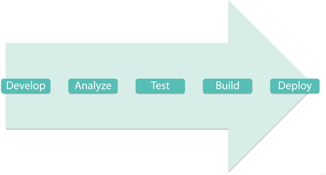

###### Fast Campus ─ Front-End AngularJS CAMP

# DAY15

### CLI 명령어 정리

```sh
$ npm install {package_name}          # NPM을 사용하여 패지키 설치하는 명령어
$ npm install --global {package_name} # 전역(Global)에 NPM 모듈 설치
$ npm init                            # 프로젝트 관리를 위한 package.json 파일 생성(질문에 답변)
$ npm init -y                         # package.json 파일 생성시 (질문을 PASS!)
```

-

### 프론트엔드 빌드 환경


서버사이드 Javascript 환경: [Node.js](http://nodejs.org) | [NPM](http://npmjs.org/)

-

### 프론트엔드 개발 제작 과정에서 반복되는 수행 업무


- `HTML` 인젝션(Injection)
- `CSS` 프리 프로세싱(`Sass` → `CSS`)
- `CSS` 제조사의 접두사(vender Prefixes `-webkit-`, `-moz-`, `-ms-`)
- `HTML`/`CSS`/`Javascript` 병합(Concatenation)
- `HTML`/`CSS`/`Javascript` 압축(Minification)
- 버전 관리
- 유닛 테스트
- 코드 분석

-

### 업무 자동화(Automate Tasks)

> 스마트하게 일 하세요. 개고생하지 말고! (Work Smarter, Not Harder)



1. 개발(Develop)
1. 분석(Analyze)
1. 테스트(Test)
1. 빌드(Build)
1. 배치(Deploy)

---

### [Gulp](http://gulpjs.com/) - Automate and enhance your workflow

모던 워크플로우 빌드 툴: **업무 향상을 위한 자동화 도구**


-

#### 1. Gulp 전역 설치:

```sh
$ npm install --global gulp # npm i -g gulp
```

> 설치된 글로벌 Node 패키지 리스트를 확인하는 명령어
```sh
$ npm list -g --depth=0
```

-

#### 2. 프로젝트에서 사용할 Gulp 로컬 모듈 설치:

```sh
$ npm install --save-dev gulp # npm i -D gulp
```

> **글로벌 설치와 로컬 설치가 모두 필요한 이유**<br>
> Node.js 프로그램을 명령창에서 실행하려면 `node`를 사용해야 한다. 예) $ `node exe.js`<br>
> 하지만 모듈을 글로벌 설치하면 `node` 명령을 앞에 붙이지 않고도 바로 사용이 가능해진다. 예) `gulp default`<br>
> 반면 모듈 로컬 설치는 프로젝트 디렉토리 내에서 의존하는 모듈을 불러오는 프로그램에서 사용된다.

-

##### ※ 의존 모듈 VS 개발 의존 모듈

ependencies(`--save`) | DevDependencies(`--save-dev`)
-------------|---------------
실행(런타임) 중에 필요 | 개발 과정 중에만 필요
Express, Angular, jQuery... | Concat, JSHint, Uglify...
$ `npm install --save {Package}` | $ `npm install --save-dev {Package}`

-

#### 3. 프로젝트 루트 경로에 `gulpfile.js` 생성:

- 프로젝트에 요구되는 의존 모듈을 읽어온다.
- 자동화할 업무를 등록한다.

```js
// CommonJS 표준 진영의 모듈 로더 방식을 사용하는 Node.js 환경에서는
// require() 함수를 사용하여 의존 모듈을 읽어온다.
var gulp = require('gulp');

// Gulp 객체의 task() 메소드를 사용하여 자동화할 업무를 등록한다.
// Gulp 기본 업무(Default Task) 등록
gulp.task('default', function() {
  // 기본 업무 작성
});
```

-

#### 4. 명령창에서 `gulp` 명령 실행:

```sh
$ gulp # gulp default
```

---

### Gulp API

#### 1. [gulp.task](#gulptaskname-deps-fn)(name[, deps], fn)

업무(Task)를 정의할 때 사용한다.

```js
gulp.task('sass', function() {
    // 업무 등록
});
```

-

#### 2. [gulp.src](#gulpsrcglobs-options)(globs[, options])

glob 문법(문자열, 배열)으로 소스 파일을 제공할 때 사용한다.
플러그인 파이프([piped](http://nodejs.org/api/stream.html#stream_readable_pipe_destination_options) to Plugins)를 통과하기 위한 [Vinyl files](https://github.com/wearefractal/vinyl-fs)의 [stream](http://nodejs.org/api/stream.html)을 반환한다.

```js
gulp.src('./sass/**/*.(sass,scss)')
```

-

#### 3. [gulp.dest](#gulpdestpath-options)(path[, options])

파이프를 통과한 결과를 목적지에 생성(Write files to Destination)한다.

```js
gulp.src('./sass/**/*.(sass,scss)')
  .pipe(sass())
  .pipe( gulp.dest('./css/') );
```

-

#### 4. [gulp.watch](#gulpwatchglob--opts-tasks-or-gulpwatchglob--opts-cb)(glob[, opts, cb])

파일의 변경 사항을 감지하여 등록된 업무를 처리한다.

```js
gulp.watch(['./sass/**/*.(sass,scss)'], ['sass']);
```

-

### 참고 자료
- [플러그인 목록](http://gulpjs.com/plugins/)
- [Gulp Documentation](http://gulpjs.org/API.html)
- [Gulp 한국어 참조 문서](https://github.com/preco21/gulp-docs-ko)

---

## GulpJS를 사용하여 업무 자동화 처리 프로그램 작성

### Javascript 코드 분석

- [JSHint](http://jshint.com/docs)<br>잠재적인 문제점 및 오류 감지
- [JSCS](http://jscs.info/)<br>Javascript 코드 스타일 체크

-

##### 규칙 파일

JSON 포멧을 사용하여 JSHint, JSCS 규칙 정의

`.jshintrc` | `.jscsrc`

-

##### [Gulp JSHint](https://www.npmjs.com/package/gulp-jshint), [Gulp JSCS](https://www.npmjs.com/package/gulp-jscs) 의존 모듈 설치

```sh
# gulp-jsint, gulp-jscs 의존 모듈 설치
$ npm i -D gulp-jsint gulp-jscs
```

-

##### `gulpfile.js`에 의존모듈 로드

```js
var jshint = require('gulp-jshint');
var jscs   = require('gulp-jscs');
```

-

##### `gulpfile.js`에 자동화 업무 등록

```js
gulp.task('validate-js', () => {
    gulp.src('./*.js')
        // {'fix': true} 옵션 설정 가능. gulp.dest() 필요
        .pipe( jscs() )
        // 'fail', 'failImmediately' 옵션 설정 가능.
        .pipe( jscs.reporter() )
        .pipe( jshint() )
        // $ npm i -D jshint-stylish 모듈 설치 요구됨.
        // .pipe( jshint.reporter('jshint-stylish'), {'verbose': true} );
        .pipe( jshint.reporter('fail') );
});
```

-

##### [Gulp Util](https://www.npmjs.com/package/gulp-util) 모듈 설치

```sh
$ npm i -D gulp-util
```

```js
// gulp-util 의존모듈 로드
var util = require('gulp-util');
// 재사용 가능한 함수 log 등록
function log(msg) {
    if ( typeof msg === 'object' ) {
        for ( var item in msg ) {
            if ( msg.hasOwnProperty(item) ) {
                // 등록 가능한 색상
                // black
                // red
                // green
                // yellow
                // blue
                // magenta
                // cyan
                // white
                // gray
                util.log( util.colors.green( msg[item] ) );
            }
        }
    } else {
        util.log( util.colors.green(msg) );
    }
}
```

-

##### [Gulp Print](https://www.npmjs.com/package/gulp-print) 모듈 설치

```sh
$ npm i -D gulp-print
```

```js
// gulp-print 의존모듈 로드
var print = require('gulp-print');
```

-

##### [Gulp If](https://www.npmjs.com/package/gulp-if) 모듈 설치

```sh
$ npm i -D gulp-if
```

```js
// gulp-if 의존모듈 로드
var gulp_if = require('gulp-if');
```

-

##### [Yargs](https://www.npmjs.com/package/yargs) 모듈 설치

```sh
$ npm i -D yargs
```

```js
// gulp-if 의존모듈 로드
var yargs = require('yargs').argv;
```

-

##### [Gulp Load Plugins](https://www.npmjs.com/package/gulp-load-plugins) 모듈 설치

```sh
$ npm i -D gulp-load-plugins
```

```js
// gulp-if 의존모듈 로드
var $ = require('gulp-load-plugins')({'lazy': true});
```