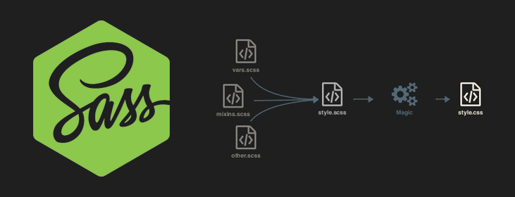

###### Fast Campus ─ Front-End AngularJS CAMP

# DAY16

### 코드 재사용 모듈 분리/관리

루트 경로에 `gulp_tasks/utils` 디렉토리 생성 후, 재사용 할 코드를 작성.

-

#### 1. type.js

Javascript 데이터 유형 체크 모듈(함수)

```js
'use strict';

// Object.prototype 메소드 빌려쓰기
var toString = Object.prototype.toString;

// 공개 모듈(함수)
function type(data) {
  return toString.call(data).slice(8, -1).toLowerCase();
}

// 모듈 공개
module.exports = type;

```

-

#### 2. log.js

명령어 인터페이스(CLI) 콘솔 기록(Console Log) 모듈(함수)

```js
'use strict';

// 의존 모듈
var util = require('gulp-util');
var type = require('./type');

// 로그 함수(비공개)
function _log(data, color) {
  util.log(util.colors[color]('───────────────────────────────'));
  util.log(' ' + util.colors[color](data));
  util.log(util.colors[color]('───────────────────────────────'));
}

// 공개 모듈(함수)
function log(logData, color) {

  // color 전달인자 초기화
  color = color || 'blue';

  // 유효성 검사
  if (!logData) { return console.error('전달인자가 존재하지 않습니다.'); }

  // 조건 1. '문자열'
  if (type(logData) === 'string') {
    _log(logData, color);
  }

  // 조건 2. '객체'
  if (type(logData) === 'object') {
    for (var key in logData) {
      if (logData.hasOwnProperty(key)) {
        _log(logData[key], color);
      }
    }
  }

}

// 모듈 공개
module.exports = log;
```

---

### 에디터에 JSCS 코딩 스타일 패키지 설치/활용

애용하는 에디터에 JSCS 코딩 스타일 체크 플러그인 설치.

- [Sublime Text](https://github.com/SublimeLinter/SublimeLinter-jscs/)
- [Bracket](https://github.com/EvNaverniouk/brackets-jscs)
- [etc.](http://jscs.info/overview#friendly-packages)

-

#### 1. Sublime Text 에디터의 경우, [JSCS](https://www.npmjs.com/package/jscs) 노드 패키지 글로벌 설치 요구.

```sh
$ npm i -g jscs
```

-

#### 2. [SublimeLinter](https://packagecontrol.io/packages/SublimeLinter) 패키지 설치 요구

```py
# 커멘드 팔레트(Command Palette) - OSX(cmd+shift+p), Windows(ctrl+shift+p)
# 커멘드 입력: Package Control: Install Package
Package Control: Install Package
# 'linter' 입력 후, SublimeLinter 선택 설치
SublimeLinter
```

---

### Browserify 번들링(묶음, Bundling) 속도가 느리다면?

소스맵(Sourcemap)을 번들(Bundle) 파일에 매번 포함해서 생성하면 느려진다.

-

##### 소스맵을 외부에 분리하는 명령어

- [Browserify - external source maps](https://github.com/substack/node-browserify#external-source-maps)
- [Exorcist](https://github.com/thlorenz/exorcist)

```sh
# exorcist 모듈 글로벌 설치 (의존)
$ npm install --global exorcist
# --debug (-d) = 소스맵 생성 옵션, exorcist = 엑소시스트(퇴마사)
$ browserify app.js -d | exorcist app-bundle.js.map > app-bundle.js
```

※ Gulp를 사용하여 Browserify를 자동화 할 경우, 소스맵 파일 분리는 `gulp-sourcemaps` 모듈로 처리. (아래 참고)

---


### Gulp & Browserify 모듈 설치 및 설정

[설치 레시피](https://github.com/gulpjs/gulp/blob/master/docs/recipes/browserify-uglify-sourcemap.md)를 참고하여 Browserify 자동화 업무를 작성.

-

###### 참고 글

- [npm VS bower VS browserify VS gulp VS grunt VS webpack](http://stackoverflow.com/questions/35062852/npm-vs-bower-vs-browserify-vs-gulp-vs-grunt-vs-webpack)
- [gulp VS grunt VS webpack 비교](http://stackshare.io/stackups/gulp-vs-grunt-vs-webpack)

-

#### 0. Browserify 사용을 위해 설치가 필요한 모듈

- **[browserify](https://www.npmjs.com/package/browserify)**<br>
    CommonJS 진영 모듈 관리를 브라우저 기반에서도 사용할 수 있도록 번들링.
- **[vinyl-source-stream](https://www.npmjs.com/package/vinyl-source-stream)**<br>
    Browserify 스트림(stream) 데이터를 Gulp에서 사용할 수 있도록 변경.
- **[vinyl-buffer](https://www.npmjs.com/package/vinyl-buffer)**<br>
    Browserify 스트림(stream) 데이터를 Gulp에서 사용할 수 있도록 변경 시, 충격 완화(buffering).
- **[gulp-sourcemaps](https://www.npmjs.com/package/gulp-sourcemaps)**<br>
    Browserify 번들 과정에서 소스맵(Sourcemap)을 생성.

-

#### 1. Browserify 의존 모듈 설치

```sh
# npm install --save-dev {Packages}
$ npm i -D browserify vinyl-source-stream vinyl-buffer gulp-sourcemaps
```

-

#### 2. `gulpfile.js`에 Browserify 의존 모듈 로드

```js
var browserify = require('browserify');
var source     = require('vinyl-source-stream');
var buffer     = require('vinyl-buffer');
// gulp-load-plugins 플러그인 사용 시, 로드하지 않고 $.sourcemaps 사용.
var sourcemaps = require('gulp-sourcemaps');
```

-

#### 3. `gulpfile.js`에 Browserify 번들링 업무 등록

```js
// --------------------------------------------------
// Browserify 옵션 설정
// 참고 URL: https://www.npmjs.com/package/browserify#browserifyfiles--opts
var config = {
    // 번들 엔트리 파일 설정
    'entries': './src/js/app.js',
    // 소스맵 파일에 포함 설정
    'debug': false,
    // 파일 확장자 설정
    'extensions': ['js', 'json'],
    // 글로벌 삽입
    // process, global, __filename, __dirname 항상 삽입
    // ※ 빌드 속도는 향상하지만, 출력(Output) 파일 크기는 커짐
    'insertGlobals': true
};

// --------------------------------------------------
// Javascript 번들링 업무 등록
gulp.task('bundle:js', ()=> {
    // 번들러 설정
    var bundler = browserify( config );
    // 번들, 소스맵 업무 수행
    return bundler
        .bundle()
        .pipe( source( 'app-bundle.js' ) )
        .pipe( buffer() )
        .pipe( sourcemaps.init({ 'loadMaps': true }) )
        .pipe( sourcemaps.write('./') )
        .pipe( gulp.dest( './.tmp' ) );
});
```

-

#### 4. `gulp.config.js` 파일에 설정 옵션 분리

```js
/*! gulp.config.js © yamoo9.net, 2016 */
'use strict';

// 경로 설정
var src = 'test/';
var tmp = './.tmp/';

// 공개 모듈(객체)
var config = {

  'src': src,

  'index': src + 'index.html',

  'browserify': {
    'options': {
      // 번들 엔트리 파일 설정
      'entries': src + 'app.js',
      // 소스맵 파일에 포함 설정
      'debug': false,
      // 파일 확장자 설정
      'extensions': ['js', 'json'],
      // 글로벌 삽입
      // process, global, __filename, __dirname 항상 삽입
      // ※ 빌드 속도는 향상하지만, 출력(Output) 파일 크기는 커짐
      'insertGlobals': true
    },
    'output': tmp,
    'outputFileName': 'bundle.js',
    'sourcemap': './'
  }

};

// 모듈 공개
module.exports = config;
```

-

#### 5. `gulpfile.js` 파일 수정

```js
// --------------------------------------------------
// 의존 모듈 로드
// --------------------------------------------------
var config = require('./gulp.config');

// --------------------------------------------------
// 번들(BUNDLE): Javascript
// Browserify 사용
// --------------------------------------------------
gulp.task('bundle:js', ()=> {
  var bundler = browserify(config.browserify.options);
  return bundler
    .bundle()
    .pipe(source(config.browserify.outputFileName))
    .pipe(buffer())
    .pipe($.sourcemaps.init({ 'loadMaps': true }))
      // 오류 발생 시, 기록 처리
      .on('error', $.util.log)
    .pipe($.sourcemaps.write(config.browserify.sourcemap))
    .pipe(gulp.dest(config.browserify.output));
});
```

-

#### 6. Watchify를 사용하여 Browserify 속도 개선

[Fast browserify builds with watchify 레시피](https://github.com/gulpjs/gulp/blob/master/docs/recipes/fast-browserify-builds-with-watchify.md)를 참고하여 문제 해결.

```js
// 의존 모듈 로드
var watchify = require('watchify');
var assign   = require('lodash.assign');

// 옵션 덮어쓰기
var opts = assign({}, watchify.args, config.browserify.options);

// Watchify 래핑된 Browserify 객체
var bundler = watchify(browserify(opts));

// Bundle 업무를 수행하는 함수
var bundleHandler = () => {
  return bundler
    .bundle()
    .pipe(source(config.browserify.output_filename))
    .pipe(buffer())
    // 오류 발생 시, 콘솔에 오류 메시지 출력
    .on('error', $.util.log.bind($.util, 'Browserify 오류'))
    // 소스맵 초기화 (이미 소스맵 파일 존재하면 해당 파일을 읽어서 속도를 향상)
    .pipe($.sourcemaps.init({'readMaps': config.browserify.read_sourcemap}))
    // 소스맵 쓰기
    .pipe($.sourcemaps.write(config.browserify.sourcemaps))
    .pipe(gulp.dest(config.browserify.output));
};

// Gulp 업무 등록
gulp.task('bundle:js', bundleHandler);
// 이벤트 처리(감지)
bundler.on('update', bundleHandler);
bundler.on('log', $.util.log);
```

-

#### 7. 옵션(`--min`)에 따라 **번들** → **압축** 프로세스 설정

[gulp-uglify](https://www.npmjs.com/package/gulp-uglify) 개발 의존 모듈을 설치.

```sh
# npm install --save-dev {package}
$ npm i -D gulp-uglify
```

```js
// --------------------------------------------------
// 번들(BUNDLE): Javascript
// Browserify 사용
// --------------------------------------------------
gulp.task('bundle:js', ()=> {
  var bundler = browserify(config.browserify.options);
  return bundler
    .bundle()
    .pipe(source(config.browserify.outputFileName))
    .pipe(buffer())
    .pipe($.sourcemaps.init({ 'loadMaps': true }))
      // 옵션 --min이 설정된 경우, 코드 압축 실행
      .pipe($.if(yargs.min, $.uglify()))
      .on('error', $.util.log)
    .pipe($.sourcemaps.write(config.browserify.sourcemap))
    .pipe(gulp.dest(config.browserify.output));
});
```

---



### CSS 프리 프로세싱(Pre Processing)

- CSS Pre Processing: [Sass](http://sass-lang.com/) → CSS
- CSS Vender Prefixes
    - [Autoprefixer](https://github.com/postcss/autoprefixer/)
    - [Autoprefixer 온라인 도구](https://autoprefixer.github.io/)
    - [Can I Use](http://caniuse.com/) 데이터를 활용하여 브라우저 제조회사 접두사 붙임 | [browserslist](https://github.com/ai/browserslist)

-

#### 0. Sass 사용을 위해 설치가 필요한 모듈

- [Gulp Sass](https://www.npmjs.com/package/gulp-sass/)
- [Gulp Autoprefixer](https://www.npmjs.com/package/gulp-autoprefixer/)
- [Gulp Sass Lint](https://www.npmjs.com/package/gulp-sass-lint/)

-

#### 1. 의존 모듈 전역 설치

```sh
# npm install --save-dev {packages}
$ npm i -D gulp-sass gulp-autoprefixer gulp-sass-lint
```

-

#### 2. `gulpfile.js`에 Sass 프리프로세싱 업무 등록

```js
// --------------------------------------------------
// Sass → CSS 프리프로세싱 업무 등록
gulp.task('sass', ()=> {

    log('Sass → CSS 변환');

    return gulp.src('src/sass/**/*.s+(a|c)ss')

        // 0. 소스맵 초기화
        .pipe($.sourcemaps.init())

        // 1.0. Sass → CSS 프리프로세싱 처리
        // Sass 옵션: https://github.com/sass/node-sass#options
        .pipe( $.sass({
            // CSS 출력 스타일 ( nested | expanded | compact | compressed )
            'outputStyle' : 'expanded',
            // 들여쓰기 유형 ( space | tab )
            'indentType'  : 'tab',
            // 들여쓰기 폭 ( 2 ~ 10 )
            'indentWidth' : 2,
            // 수치 정확도 (소수점 이하 자리 수)
            'precision'   : 4,
            // 소스맵 작성 설정
            'sourceMap'   : true
        })
        // 1.1. 오류 발생 시, 처리 (관철 업무 중 중지하지 않음)
        // Gulp 관찰 업무 중 오류가 발생해도 멈추지 않음 설정
        // https://github.com/gulpjs/gulp/issues/71
        // Gulp Plumber 대체 사용
        // https://www.npmjs.com/package/gulp-plumber
        .on('error', $.sass.logError) )

        // 2. Sass List 처리
        // ※ Sass-lint를 에디터에서 자동 체크할 경우, sass-lint 모듈은 제외.
        .pipe($.sassLint())
        .pipe($.sassLint.format())
        .pipe($.sassLint.failOnError())

        // 3. Autoprefixer 처리
        // Autoprefixer 옵션 참고
        // https://github.com/postcss/autoprefixer#options
        // Browserlist: https://github.com/ai/browserslist#queries
        // 예) ['ie 6-8', 'Chrome >= 40', 'Firefox ESR', 'iOS 7']
        .pipe( $.autoprefixer({'cascade': false, 'browsers': ['last 2 versions', '> 5% in KR']}) )

        // 4. 소스맵 작성
        .pipe($.sourcemaps.write('./maps'))

        // 5. 목적지에 파일 생성
        .pipe( gulp.dest('./.tmp') );
});
```

---

### 에디터에 Sass Lint 패키지 설치/활용

애용하는 에디터에 Sass Lint 체크 플러그인 설치.

- [Sublime Text](https://github.com/skovhus/SublimeLinter-contrib-sass-lint)
- [Bracket](https://github.com/petetnt/brackets-sass-lint)
- [etc.](https://www.npmjs.com/package/sass-lint#ide-integration)

-

#### Sublime Text 에디터의 경우, [sass-lint](https://www.npmjs.com/package/sass-lint) 노드 패키지 글로벌 설치 요구됨.

※ SublimeLinter 패키지 설치 요구 (이미 설치했다면 Skip)

```sh
$ npm i -g sass-lint
```

---

### 컴파일 된 CSS 스타일 파일 제거 업무 등록

#### 1. `gulp.task('sass:clear',()=>{...})` 코드 작성

```js
// --------------------------------------------------
// 컴파일 된 CSS 스타일 파일 제거 업무
gulp.task('sass:clear', ()=> {
    var files = './.tmp/' + '**/*.css';
    del(files);
});
```

[`del`](https://www.npmjs.com/package/del) 개발 의존성 노드 패캐지 모듈 설치 필요

```sh
# npm install --save-dev del
$ npm i -D del
```

-

#### 2. 생성된 코드 제거 함수 작성

루트 경로 `gulp_tasks/utils` 디렉토리 내부에 `clear.js` 파일 추가

**clear.js**

```js
'use strict';

var util = require('gulp-util');
var del  = require('del');

function clear(path, done) {
    log('파일 제거:' + util.colors.blue(path));
    del(path, done);
}

module.exports = clear;
```

-

#### 3. `sass:clear` - 스트림(Stream) 종료 후(Sync) 실행 → `sass` 설정

```js
// clear 모듈 로드
var clear = require('./gulp_tasks/utils/clear');

// --------------------------------------------------
// 컴파일 된 CSS 스타일 파일 제거 업무
gulp.task('sass:clear', (cb)=> {
    var files = './.tmp/' + '**/*.css';
    clear(files, cb);
});

gulp.task('sass', ['sass:clear'], ()=> {
    // ...
});
```

-

#### 4. `sass:watch` 관찰 업무 등록

Sass 파일(`src/sass/**/*.s+(a|c)ss`)의 변경 사항이 감자되면 `sass` 업무 자동 수행

```js
gulp.task('sass:watch', ()=> {
    gulp.watch('src/sass/**/*.s+(a|c)ss', ['sass']);
});
```