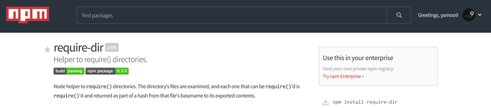
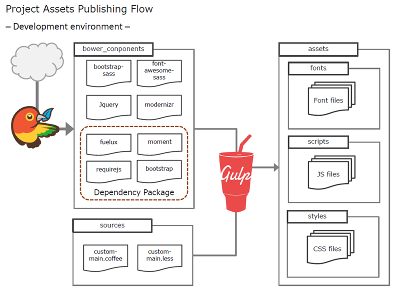
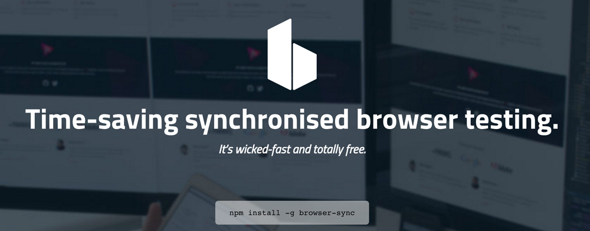

###### Fast Campus ─ Front-End AngularJS CAMP

# DAY17

### 읽어보아요 :-)

#### [왜 배워도 못하는가? 1 : 뛰어난 선생에 대한 미신](http://agile.egloos.com/5826929)

조직과 개인들 모두 많은 돈과 시간을 투자해 교육을 듣습니다. 거기에는 **"아마 그만큼 효과가 있겠지"** 혹은 **"안 하는 것보다는 낫겠지"**하는 기대 심리가 있겠죠. 그런데, 정말 효과가 있는 걸까요?

흥미롭게도 많은 조직에서 교육은 투입으로 성과를 측정하는 대표적 분야입니다. 얼마나 썼냐로 얼마나 잘했냐를 본다는 건데요. 예컨대, "사장님 올해에는 저희 직원 중 몇 퍼센트가 리더십 교육을 수료했습니다" 같은 것 말이죠. 그 직원 중 몇 퍼센트가 해당 교육에서 실질적인 도움을 얻었을까는 미지수입니다.

기업에서의 교육/훈련 효과에 대한 메타분석연구에 따르면 **대부분의 훈련은 시간이 6개월 정도만 지나도 거의 효과가 사라집니다.** 하지만 교육이 끝나는 시점에는 그렇게 생각이 안들었겠죠. 만족도도 높고 굉장히 도움이 된다는 느낌이 들었을 겁니다.

왜 효과가 별로 없을까요? 여러가지 복합적인 이유가 있고 블로그 글로 다루기에는 너무 큰 주제인데, 크게 보면 학습자, 교사, 교육방식과 내용, 조직환경 등의 이유가 있을 수 있습니다.

많은 조직들이 강사의 전문 지식 수준을 매우 중요하게 여깁니다. 어쩌면 거의 유일하게 생각하는 것일지도 모르겠는데요. 근데, 이것과 학생들의 성취도 간에 정말 높은 관련이 있을까요?

존 해티의 연구에 따르면 교사의 주제에 대한 지식 수준(teacher's subject matter knowledge)은 효과 크기가 0.09에 지나지 않으며(약 100여개의 연구를 통합) 150여개의 학업 성취도에 영향을 끼치는 요인들 중 꼴지에서 15등 정도 합니다(참고로 해티는 그 요인의 효과크기 중위값인 0.40에 해당하는, 66등 아래의 요소는 학생의 학업성취도 개선을 위해 권하지 않습니다). **교사가 지식이 얼마나 많은가가 크게 중요한 요소가 아니다**는 말이지요.

왜 그럴까요? 물론 여기에도 여러가지 설명이 가능합니다만 오늘은 아는 것을 정말 가르칠 수 있는가 하는 면에 초점을 맞춰보죠.

의료계의 연구를 보면, 전문가가 특정 수술법(윤상갑상막 절개술이나 결장경 검사 같은 비교적 단순한 것에 대해서도)에 대해 학생들을 **가르칠 때 자신이 가진 지식(의료적 지식, 무엇을 어떻게 해야할지에 대한 행동 단계, 의사결정 단계 등)의 70%를 가르치지 않는다**는 분석이 여러번 거듭해 나왔습니다.

탁월한 선생으로 대학병원에서 인정을 받고 모두 한 번 이상의 "탁월한 교사상" 을 받은 사람임에도 그랬고, 되도록 단계나 지식을 빠짐없이 가르쳐 주라는 특별한 주문을 했음에도 그러했습니다. 심지어는 끝나고 나서 혹시 빠트린 것이 있읍니까 하고 물어서 그걸 추가해도 여전히 70% 정도는 빠트렸습니다. **그 기술을 성공적으로 해내기 위해 필요한 것의 30%만 가르치고 자신은 다 가르쳤다고 생각**하는 겁니다.

이런 현상이 벌어지는 이유는 여러가지가 있지만 대표적인 것은 자동화입니다. 전문가가 되면 자신이 하는 것이 자동화되어서 암묵적이 되어 버립니다. 그래서 오히려 인식이 없어지는 것이죠.

자, **전문가가 간단한 수술을 가르칠 때에도 자신이 해당 수술에 대해 알고, 하는 것의 30%도 가르치지 못합니다.** 배웠는데도 못하는 것이 좀 더 정상적으로 느껴지지 않으십니까?

**선생을 고르는 입장**에서는 **지식이 얼마나 많냐는 것만 보지말고, 자기에 대한 메타인지(간단히 말하면 자기분석 능력과 기술)가 높은가(그리고 그걸 전달할 수 있냐)**도 중요하게 봐야겠죠. 자, 이제는 여러분들이 **"실전에서 오랜 경험을 한 뛰어난 강사"라는 광고를 보면 좀 더 현실적으로 바라볼 수 있지 않을까** 싶네요. ^^;

이는 자전거 타는 방법을 말로 배우는 것 같죠. **사실 대부분의 학습은 피드백 과정**이죠. **오류로부터 스스로의 행동을 정의해나가는**.

강사로부터 **무언가를 깨닫는 사람들의 다수는 이미 그걸 깨닫고 있던 사람들**이죠. **아이러니**.

-

#### [왜 배워도 못하는가? 2 : 전문가에 대한 미신](http://agile.egloos.com/5827377)

> **전문가의 사회성**에 대한 이야기를 합니다. Sass를 예로 들어 내용을 다소 변경 해보았습니다.

Sass 교육을 통해 사람들이 기대하는 일반적인 과정은 보통 다음과 같을 것입니다.

1. Sass를 제대로 이해하고 조직에 돌아가서
1. (나 스스로 Sass를 제대로 실천해서 객관적 성과를 내서)
1. Sass가 좋다고 사람들을 설득하고
1. Sass를 가르쳐 준다.
1. 모두가 Sass를 열심히 해서
1. 좋은 성과를 낸다.

여기에서 보통 문제가 되는 부분은 3-6번입니다. 그리고 1과 2를 잘 한다고 해서 3번 이후가 꼭 쉬워지는 것이 아닙니다. 하지만 교육에서는 보통 1번에만 집중을 합니다. 실무로 돌아가면 흔히 접하는 문제는 예컨대 다음과 같습니다.

- 회사로 돌아가서 실제 업무를 하려고 하는데 상사나 동료의 지원없이 추가적으로 하려니, 시간 압박으로 나중에 해도 될 일로 미뤄지다가 결국 적용하지 못하게 된다거나
- 팀원/팀장들에게 전파교육하려 하지만 정작 팀원/팀장들 가운데 몇몇은 왜 해야 하는지 필요성도 못느끼는 상태에서 강제로 해야 하는 스트레스로 작용해서 부작용이 생긴다거나(그래서 결과적으로 Sass는 안된다는 평가가 나오거나)
- 팀 내에서는 열심히 적용을 했으나 지원해주는 임원이 없어 확대 적용에 실패하고, 조직 내에서 별난 문화로 치부되어 축소되어 버리거나
- 다른 부서는 그런 거 없이도 잘 하는데 너희는 왜 그런거 하면서 제때 아웃풋이 안나오냐며 이해할 수 없다고 말하는 상사나 협력 팀의 리더와 갈등을 겪는다거나
- 기술적으로 어떻게 해야 할 지 모르겠는데, 주변에 물어 볼 사람이 없고, 인터넷 검색하는데 몇시간씩 보낸 후 원하는 것을 찾지 못해서 포기하거나
- 회사에서 다른 업무를 처리하느라 Sass 적용을 집으로 가져와 밤 늦게까지 좀 해보려 했더니, 부모님/형제자매/아내/아이 등의 가족들의 여러 요구로 인해 집중할 수 없어 화를 내거나, 가족의 요구대로 하느라 Sass는 시작도 못하거나, 그냥 포기하고 잠을 자버리거나

이런 문제들은 보통 사회적 측면에 대한 것입니다. 이것이 중요한 이유는, 간략히 말하자면 다음과 같은 논리입니다.

1. 아무리 기술적인 실천법이라고 해도
1. 그 기술은 사회적 맥락 속에서 실천되어야 하며
1. 그 기술의 성공을 위해서는 사회적 자본과 사회적 기술이 함께 필요하다.

응용통계학자 출신인 존 가트맨은 자신의 책 **"신뢰의 과학"**에서 다음 연구를 인용합니다.

> 남편과 부인은 서로 신뢰가 깨어져 있습니다. 맞벌이 부부인데, 그 날 따라 남편이 일찍 퇴근을 했습니다. 싱크대에 그릇이 쌓여있는 걸 보고는 남편은 웬일인지 설겆이를 했습니다. 여기까지를 몰래 카메라로 촬영해서 제삼자들에게 보여주면 다들 "남편이 선의의 행동을 했다"라고 평가를 내립니다. 반전은 부인이 집에 들어오면서부터입니다. 부인은 반대로 화를 냅니다. 항의하려고 이렇게 한거냐. 나보고 좀 이렇게 하라는 뜻이냐 등등.

가트맨은 이렇게 풀이합니다. 신뢰가 깨어져 있는 상태에서는 어떤 행동을 해도 악의의 행동으로 보게 된다는 것입니다.

예를 들면, 팀장은 선의로 팀원들에게 책을 선물합니다. 그런데 신뢰가 이미 깨어져 있습니다. 그러면 팀원들이 느끼기에는 악의의 행동으로 보입니다. '나 보고 이런 거 모르니 공부하라는 얘기야? 자기는 쥐뿔도 모르면서...' 이 신뢰를 **사회적 자본의 일종**이라고 합니다. 소위 말하는 소셜 네트워크가 좋다고 하는 것도 사회적 자본의 일종입니다. 이런 사회적 자본이 좋은 사람들은 통상 사회적 기술이 뛰어납니다. 반대로 음의 기술을 가진 사람도 존재합니다 -- 커뮤니케이션할수록 신뢰가 깨어진다든지.

전문가가 해당 도메인 지식만 뛰어난 사람이라는 것은 대표적인 미신입니다. **전문가는 사회적 자본과 사회적 기술이 뛰어납니다.**

한 연구에서는 개발자들에게 초보 개발자에게 해 줄 조언을 적어보라고 했습니다. 평균 7년 경력의 개발자들이었는데(경력과 실력은 상관성이 없었음) **뛰어난 개발자들은 약 70%가 동료와의 협력**을 언급하는 반면 실력이 그저 그런 사람들은 20%도 안되는 사람들만이 동료와의 협력을 언급했습니다. 이 정도 큰 차이가 있기 때문에 이 부분은 면접에서 개발자의 실력을 가릴 때에도 도움이 될 수 있겠죠.

다시 제목으로 돌아옵시다. 왜 교육을 받아도 못할까요? 그것은 사회적 자본과 기술이 없이 해당 도메인 지식만 배웠기 때문입니다. 그리고 그런 사회적 자본과 기술이 없는 상황에서 높은 도메인 지식은 확산과 성공에 오히려 장애가 되기도 합니다. ([개인이 조직을 바꾸는 법(영상)](http://agile.egloos.com/5742985) 참고). 희망적인 소식은 이런 사회적 기술이 훈련에 의해 개선이 가능하다는 것이죠 -- FBI나 미특수 부대, 심리상담, 리더십 등의 영역에서 그 효과에 대한 실증적 연구가 이미 많이 이루어졌습니다.

**어떤 기술적 지식을 전달해도 그것을 사회적 맥락 속에서 가르치고 경험하게 하려고 노력해야 합니다.**

마지막으로 한국 애자일 사용자 모임에서 있었던 일화로 글을 맺을까 합니다.

> 제가 잘 아는 후배가 자신이 속한 조직의 형상 관리 도구를 subversion에서 git으로 성공적으로 안착시킨 사례를 이야기하고 있었습니다. 잘 아시겠지만 이것이 그리 쉽지 않습니다. 그 후배는 대리 직급에서 그 일을 했고요. 사례 공유가 끝나자 청중에서 한 분이 손을 들고 물으시더군요. "이해가 되지 않습니다. 저 역시 그렇게 하려고 git의 장점에 대한 발표도 하고 교육도 몇 번에 걸쳐 해줬는데 결국 사람들이 쓰게 하는 데에 실패했습니다. 사람들이 너무 수동적이고 보수적이에요."

저는 그 분에게 한 가지 질문을 역으로 물었습니다.

**"그 조직원들이 선생님을 좋아하나요?"**

그 분과 제 후배의 상반된 답은 아마도 여러분이 짐작하실 수 있지 않을까 하네요.

"사람들이 왜 당신을 좋아하나요?"라는 질문에 박경림씨가 이렇게 답변했던 것으로 기억합니다.

**'진짜 친해질때까지는 이렇게 해라 저렇게 해라 조언을 하지 않았습니다 그냥 들어주었습니다'**

다른 사람을 변화시키고자 한다면 변화 시키기 이전에 매우 깊은 신뢰관계가 있어야 한다는 것...

저도 매우 중요하게 생각합니다.

---

[](https://www.npmjs.com/package/require-dir)

---

### `require-dir` 패키지

[require-dir](https://www.npmjs.com/package/require-dir) 패키지 모듈은 Node 패키지 모듈을 읽어들이는데(`require()`) 유용. 디렉토리 내 개별 적인 파일을 읽어들일 수 있는지 검토한 후, 읽어들일 수 있다면 모두 읽어들임.

-

#### 1. 패키지 설치

```sh
# npm i -D require-dir
$ npm install --save-dev require-dir
```

-

#### 2. 패키지 모듈 로드

```js
var requireDir = require('require-dir');
```

-

#### 3-1. 디렉토리 구조

다양한 파일이 포함된 디렉토리에서 읽어들일 수 있는 파일만 선별하여 로드.

```sh
dir
├── a.js
├── b.coffee
├── c.txt
└── d.json
```

`requireDir('./dir')` 명령을 사용하면 읽어들일 수 있는 파일 목록이 형성/처리됨.

```js
{
  a: require('./dir/a.js'),
  d: require('./dir/d.json')
}
```

-

#### 3-2. requireDir 모듈을 통해 디렉토리 로드

```js
requireDir('./dir');
```

-

#### 4-1. 서브 디렉토리를 포함하는 디렉토리 로드

서브 디렉토리를 포함하는 경우, 옵션 `{'recurse': true}`을 설정하여 로드 가능.

##### 디렉토리 구조

```sh
dir
└── sub_dir
    ├── a.js
    ├── b.coffee
    ├── c.txt
    └── d.json
```

##### 옵션 설정

```js
requireDir('./dir', {'recurse': true});
```

---

### Gulp 업무 모듈별 세부 관리

#### 1. RequireDir 모듈 활용

`gulpfile.js` 파일에는 `require-dir` 모듈만 로드.

```js
/*! gulpfile.js © yamoo9.net, 2016 */
'use strict';

// 모듈 로드
require('require-dir')('./gulp_tasks',{'recurse':true});
```

-

#### 2. Gulp 업무 별 모듈 파일 생성/관리

```sh
gulp_tasks
├── browserify.js
├── default.js
├── sass.js
└── utils
    ├── loadModules.js
    ├── log.js
    └── type.js
```

##### default.js

```js
/*! gulp.default.js © yamoo9.net, 2016 */
'use strict';

var gulp = require('gulp');
var loadModules = require('./utils/loadModules');

// Gulp 의존 업무 모듈(파일) 로드
loadModules([
  './browserify',
  './sass'
]);

gulp.task('default', ['browserify:watch', 'sass:watch']);
```

##### utils/loadModules.js

```js
/*! loadModules.js © yamoo9.net, 2016 */

'use strict';

var type = require('./type');

module.exports = function(modules) {
  modules = type(modules) !== 'array' || [];
  for (var module of modules) {
    require(module);
  }
};
```

##### browserify.js

```js
/*! browserify.js © yamoo9.net, 2016 */
'use strict';

// --------------------------------------------------
// 의존 모듈 로드
// --------------------------------------------------
var gulp   = require('gulp');
var yargs  = require('yargs').argv;
var log    = require('./utils/log');
var config = require('../gulp.config');
// --------------------------------------------------
// Browserify 사용을 위한 모듈 로드
// Watchify, lodash.assign
// --------------------------------------------------
var browserify = require('browserify');
var watchify   = require('watchify');
var assign     = require('lodash.assign');
var source     = require('vinyl-source-stream');
var buffer     = require('vinyl-buffer');
// --------------------------------------------------
// Gulp 플러그인 모듈 로더
// --------------------------------------------------
var $ = require('gulp-load-plugins')({'lazy': true});


// --------------------------------------------------
// 번들링(Bundling): Javascript 업무 등록
// --------------------------------------------------
// 번들러 정의
var bundler = browserify(config.browserify.options);
// Bundle 업무를 수행하는 함수
var bundleHandler = (message) => {
  log(message);
  return bundler
    .bundle()
    .pipe(source(config.browserify.output_filename))
    .pipe(buffer())
      // 오류 발생 시, 콘솔에 오류 메시지 출력
      .on('error', $.util.log.bind($.util, 'Browserify 오류'))
      // 조건 --min 옵션 값(true, false)에 따라 압축(Uglify) 처리
      .pipe($.if(yargs.min, $.uglify()))
    // 소스맵 초기화 (이미 소스맵 파일 존재하면 해당 파일을 읽어서 속도를 향상)
    .pipe($.sourcemaps.init({'readMaps': config.browserify.read_sourcemap}))
    // 소스맵 쓰기
    .pipe($.sourcemaps.write(config.browserify.sourcemaps))
    .pipe(gulp.dest(config.browserify.output));
};

// browserify 업무
gulp.task('browserify', bundleHandler.bind(gulp, 'Javascript 번들링'));

// browserify 관찰 업무
gulp.task('browserify:watch', function() {
  // 옵션 덮어쓰기
  var opts = assign({}, watchify.args, config.browserify.options);
  // Watchify 래핑된 Browserify 객체
  bundler = watchify(browserify(opts));
  bundleHandler.call(gulp, '번들링 관찰 중...');
  // 이벤트 처리(감지)
  bundler.on('update', bundleHandler);
  bundler.on('log', $.util.log);
});
```

##### sass.js

```js
/*! sass.js © yamoo9.net, 2016 */
'use strict';

// --------------------------------------------------
// 의존 모듈 로드
// --------------------------------------------------
var gulp   = require('gulp');
var log    = require('./utils/log');
var config = require('../gulp.config');
// --------------------------------------------------
// Gulp 플러그인 모듈 로더
// --------------------------------------------------
var $ = require('gulp-load-plugins')({'lazy': true});

// --------------------------------------------------
// 프리프로세싱(Pre-Processing): Sass → CSS 업무 등록
// --------------------------------------------------
gulp.task('sass', ()=> {
  log('Sass → CSS 변환');
  return gulp
    .src(config.sass.src)
    // 소스맵 초기화
    .pipe( $.sourcemaps.init({'readMaps':true}) )
    // Sass 컴파일
    .pipe( $.sass(config.sass.options).on('error', $.sass.logError) )
    // 벤더 프리픽스 자동으로 처리
    .pipe( $.autoprefixer(config.sass.autoprefixer) )
    // 소스맵 쓰기
    .pipe( $.sourcemaps.write(config.sass.sourcemaps) )
    // 스트림 데이터 파일을 목적지에 실제 파일로 쓰기
    .pipe( gulp.dest(config.sass.output) );
});

gulp.task('sass:lint', ()=> {
  log('Sass 문법 검수');
  return gulp.src(config.sass.src)
    .pipe($.sassLint())
    .pipe($.sassLint.format())
    .pipe($.sassLint.failOnError());
});

gulp.task('sass:watch', ['sass'], ()=> {
  log('Sass 관찰 업무');
  gulp.watch(config.sass.src, ['sass']);
});
```

##### gulp.config.js

```js
/*! gulp.config.js © yamoo9.net, 2016 */
'use strict';

// 프로젝트 경로
var src   = './src/';
var dist  = './dist/';
var build = './build/';
var tmp   = './.tmp/';
var test  = './test/';

// 소스맵 위치
var sourcemaps = null;

// 공개 모듈 등록
var config = {

  // 경로
  'src'   : src,
  'dist'  : dist,
  'build' : build,
  'tmp'   : tmp,
  'test'  : test,

  // Browserify 설정
  'browserify': {
    // ------------------------------------------
    // Browserify 옵션
    'options': {
      // 진입 파일 (번들링 시작 파일)
      'entries': [ test + 'app.js'],
      // 소스맵을 번들링된 파일에 포함
      // 'debug': false,
      // 번들링 속도 향상 (다만 파일 크기가 커짐)
      // 'insertGlobals': true
    },
    // ------------------------------------------
    // 번들링 파일 목적지 위치 설정
    'output': tmp,
    // 생성되는 번들링 파일 이름 설정
    'output_filename': 'app.bundle.js',
    // 분리된 소스맵 파일 위치 설정
    'sourcemaps': sourcemaps || './',
    // 이미 존재하는 소스맵 파일 읽기 설정
    'read_sourcemap': true
  },

  // Sass 설정
  'sass': {
    // ------------------------------------------
    // 진입 파일 (프리프로세싱 시작 파일)
    'src': ['./test/*.s+(a|c)ss'],
    'output': tmp + 'css',
    // ------------------------------------------
    // Sass 옵션 설정
    'options': {
      // CSS 출력 스타일 설정
      // [nested, compact, expanded, compressed]
      'outputStyle' : 'expanded',
      // 인덴트(들여쓰기) 설정
      // ['tab', 'space']
      'indentType'  : 'space',
      // 인덴트 폭 값 설정
      // 2~10
      'indentWidth' : 2,
      // 수치 정확도 (소수점 이하 자리 수)
      'precision'   : 4,
      // 소스맵 작성 설정
      'sourceMap'   : true
    },
    // ------------------------------------------
    // Autoprefixer 설정
    'autoprefixer': {
      'browselist': [
        // 지역 설정
        '> 5% in KR',
        // 데스크탑 환경 설정
        'ie >= 11',
        'chrome >= 45',
        'ff >= 40',
        'safari >= 7',
        'opera >= 23',
        // 모바일 환경 설정
        'android >= 4.4',
        'ios >= 8',
        'ie_mob >= 10',
        'bb >= 10'
      ]
    },
    // ------------------------------------------
    // 소스맵 위치 설정
    'sourcemaps': sourcemaps || './'
  }

};

// 모듈 공개
module.exports = config;
```

---


---

### HTML 문서에 필요한 파일 인젝션(Injection)

HTML 문서에 주입(Injection)되어야 할 CSS/Javascript 파일을 자동으로 관리해주는 모듈.

-



-

#### 0. HTML 인젝션 의존 모듈

- [bower](http://bower.io/)
- [wiredep](https://github.com/taptapship/wiredep/)
- [gulp-inject](https://github.com/klei/gulp-inject/)

Wiredep 모듈은 Bower에 의존하는 모듈 주입에 사용하고,<br>gulp-inject 모듈은 사용자가 정의에 따라 의존하는 모듈 주입에 사용.


-

##### 사용 예시

HTML 주석(Comments) 표기법을 사용해 인젝션 위치 설정

```html
<!DOCTYPE html>
<html lang="ko-KR">
<head>
<meta http-equiv="X-UA-Compatible" content="IE=Edge">
<meta charset="UTF-8">
<title>HTML 주입(Injection)</title>

<!-- WIREDEP 예시(CSS) -->
<!-- bower:css -->
<!-- endbower -->

<!-- GULP-INJECT 예시(CSS) -->
<!-- inject:css -->
<!-- endinject -->

</head>
<body>

<!-- WIREDEP 예시(JS) -->
<!-- bower:js -->
<!-- endbower -->

<!-- GULP-INJECT 예시(JS) -->
<!-- inject:js -->
<!-- endinject -->

</body>
</html>
```

-

#### 1.0. HTML 인젝션 의존 모듈 설치

`wiredep`, `gulp-inject` 모듈 로컬 설치

**CLI**

```sh
# npm install --save-dev {packages}
$ npm i -D wiredep gulp-inject
```

**gulp_tasks/wiredep.js**

```js
/*! wiredep.js © yamoo9.net, 2016 */
'use strict';

var gulp    = require('gulp');
var config  = require('../gulp.config');
var wiredep = require('wiredep').stream;
var inject  = require('gulp-inject');

gulp.task('wiredep', ()=> {
  gulp
    .src(config.inject.index)
    .pipe(wiredep(config.inject.getWiredepDefaultOptions()))
    .pipe(inject(gulp.src(config.inject.js)))
    .pipe(gulp.dest(config.inject.output));
  return gulp;
});
```

**gulp.config.js**

```js
// Bower 설정
// 참고 https://github.com/taptapship/wiredep#configuration
var bower = {
  'json'       : require('./bower.json'),
  'directory'  : './bower_components/',
  'ignorePath' : '..'
};

// 공개 모듈 등록
var config = {
  // ...
  // Inject 설정
  'inject': {
    'index' : test + 'index.html',
    'js': [
      test+'**/*.module.js',
      test+'**/*.js',
      '!'+test+'**/*.spec.js', // 제외
    ],
    'output': tmp,
    'getWiredepDefaultOptions': ()=> {
      return {
        'bowerJson'  : bower.json,
        'directory'  : bower.directory,
        'ignorePath' : bower.ignorePath
      };
    }
  }
}
```

-

#### 2. Bower 모듈 설치 시, 자동으로 인젝션되도록 설정

**.bowerrc** 파일

[`.bowerrc` 파일 작성법](http://bower.io/docs/config/) 참고

Bower 인스톨 과정이 종료된 이후, `postinstall` 이벤트를 통해 Gulp 명령어 실행.

```js
{
  // Bower 모듈이 설치될 디렉토리 설정
  "directory": "bower_components",
  "json" :  "bower.json",
  // HOOK 설정 (http://bower.io/docs/config/#hooks)
  "scripts": {
    // Bower 모듈 설치 이후 수행할 업무 등록
    "postinstall": "gulp wiredep"
  }
}
```

-

#### 3. inject 업무 등록

**gulp_tasks/inject.js**

```js
/*! inject.js © yamoo9.net, 2016 */
'use strict';

var gulp    = require('gulp');
var config  = require('../gulp.config');
var inject  = require('gulp-inject');

gulp.task('inject', ['wiredep', 'sass'], ()=> {
  gulp
    .src(config.inject.index)
    .pipe(inject(gulp.src(config.inject.css)))
    .pipe(gulp.dest(config.inject.output));
  return gulp;
});
```

**gulp.config.js**

```css
// Inject 설정
'inject': {
  'index' : test + 'index.html',
  'css': [
    tmp + '**/*.css'
  ],
  'js': [
    test+'**/*.module.js',
    test+'**/*.js',
    '!'+test+'**/*.spec.js', // 제외
  ],
  'output': test,
  'getWiredepDefaultOptions': ()=> {
    return {
      'bowerJson'  : bower.json,
      'directory'  : bower.directory,
      'ignorePath' : bower.ignorePath
    };
  }
}
```

-

#### 4. NPM 스크립트 명령어 활용

[참고: How to Use npm as a Build Tool](http://blog.keithcirkel.co.uk/how-to-use-npm-as-a-build-tool/)

[http-server](https://www.npmjs.com/package/http-server) 모듈 글로벌 설치 후, 실행 단축 명령 추가

**package.json**

```js
"scripts": {
  "server": "http-server -o -a localhost -p 9090"
},
```

**CLI**

```sh
$ npm run server
```

---



<!-- http://qiita.com/ka215/items/f54f190e36c454ebea73 -->

---

### 브라우저 싱크(BrowserSync)

[browsersync](http://browsersync.io)

- 파일 주입(Injection Files) 변화 감지 ([socket.io](http://socket.io) 활용)
- 다양한 모든 웹 브라우저 환경에서 다음 행동을 동기화(Syncronize Actions)
  - Click
  - Form
  - Location
  - Scroll

-

#### 1. BrowserSync 모듈 설치

```sh
$ npm i -D browser-sync
```

-

#### 2. Gulp + BrowserSync 사용법

[Gulp & browserSync](https://www.browsersync.io/docs/gulp/)

**옵션 설정 예시**

```js
// https://www.browsersync.io/docs/options/
browserSync({
  'proxy' : 'localhost:8181',
  'port'  : 9090,
  'files' : [config.src + '**/*'],
  'ghostMode': {
    'clicks'   : true,
    'location' : false,
    'forms'    : true,
    'scroll'   : true
  },
  'injectChanges'  : true,
  'logFileChanges' : true,
  'logLevel'       : 'debug',
  'logPrefix'      : 'gulp-patterns',
  'notify'         : true,
  'reloadDelay'    : 1000
})
```