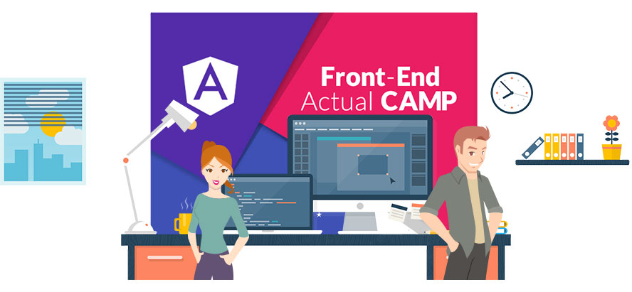

###### Fast Campus
## 프론트엔드 실전 – AngularJS CAMP

[당장 실무에 써먹어도 부족함이 없는, 프론트엔드 최신 기술이 응집된 강의](http://www.fastcampus.co.kr/dev_camp_fep_jna/)

JavaScript 패턴, jQuery 플러그인 및 UI, ECMAScript, AngularJS 등.. 
프론트엔드 기술에 관심 있는 사람이라면 누구나 혹할 최신 기술을 한 데 모았습니다. 
새롭고 강력한 프론트엔드 기술이 녹아있는 강의를 만나보세요<i>!</i>

> “새로운 것을 배우는 것이 두려움이 아닌, 즐거움이 될 수 있도록 도와드릴께요.” 
> – 야무(yamoo9)

-

#### 프론트엔드 기술을 200% 활용해봐요
HTML, CSS, JavaScript, Ajax와 같은 기본적인 프론트엔드 기술 경험을 토대로 웹 사이트 또는 모바일 앱을 제작하고자 하는 분들에게 가이드를 제시합니다.
Javascript MVC 설계 패턴부터 시작하여 AngularJS, Ionic 등 MVW(MVC+MVVM) 프레임워크를 활용하여 단일 페이지 애플리케이션(SPA)을 제작하는 방법을 다룹니다.

#### 기술을 더욱 빛나게 할 업무 자동화 환경 구현
JavaScript, AngularJS 뿐만 아니라 Node.js와 Gulp를 활용한 업무 자동화(Automation Build) 환경을 구축하게 됩니다.
CSS 프리프로세서 Sass, Sass Frameworks 등을 사용하는 야무님의 ‘모던 워크 프로세스(Modern Work Process)’는 여러분의 업무 능력을 크게 향상시켜줄 것입니다.

#### 프론트엔드 기본 지식이 탄탄하다면, 수강 OK!
본 과정을 수강하기 위해서는 탄탄한 수준의 프론트엔드 프로그래밍 기초 능력이 요구됩니다. HTML, CSS, Javascript, jQuery, Ajax와 같은 프론트엔드 기본 기술을 충분히 학습하신 경험이 있어야 본 강의 내용을 이해하기 쉬우므로, [프론트엔드 프로그래밍 입문 캠프](http://www.fastcampus.co.kr/dev_camp_fep/)를 통해 어느정도의 지식을 갖추고 계신지 가늠해보세요.